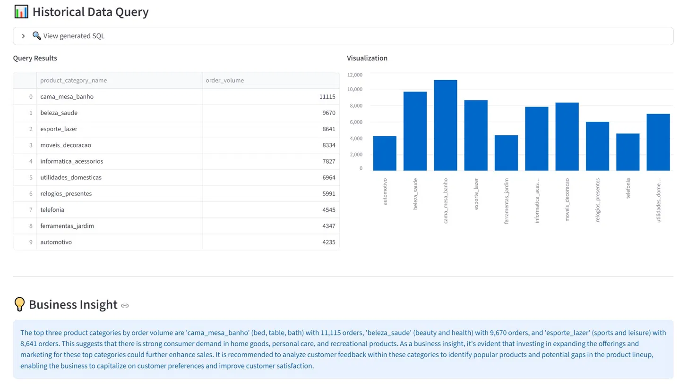
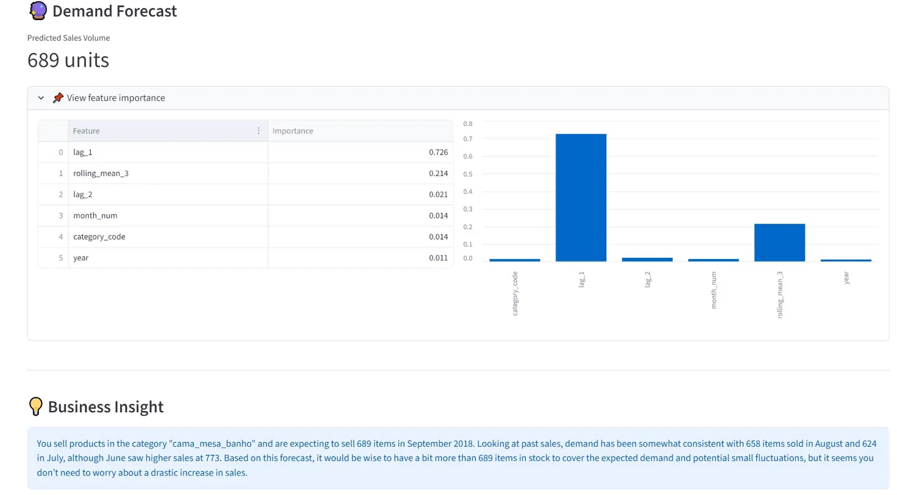

# E-Commerce Decision Agent

At e-commerce companies, market analysts spend hours manually writing SQL queries, engineering features, and running demand forecasts — only to repeat the entire cycle when stakeholders ask a follow-up question. This agent automates that workflow: ask a business question in plain English, and the system automatically routes to the right tool — SQL for historical analysis, XGBoost for demand forecasting — and returns a plain-language insight.

**[Shiyi Wang](https://github.com/Shiyi-Wang128)** · MS Data Science, UC San Diego

---

## Demo

**Historical Data Query** — natural language → SQL → results + visualization



**Demand Forecast** — natural language → auto-fetch history from DB → XGBoost → business insight



---

## How It Works

```
User Question (natural language)
        ↓
  LLM Router (GPT-4o)
  "Is this about the past or the future?"
        ↓
┌─────────────────────────┬──────────────────────────────┐
│      Text-to-SQL        │       Demand Forecast         │
│                         │                               │
│  GPT-4o generates       │  1. Auto-fetch real lag       │
│  PostgreSQL query →     │     features from DB (SQL)    │
│  runs on 100K+ orders   │  2. XGBoost predicts sales    │
└─────────────────────────┴──────────────────────────────┘
        ↓
  LLM summarizes result into plain-language business insight
```

The forecast path uses **chained tool use**: the agent first queries the database for real historical sales, then feeds those numbers into XGBoost — no manual input required from the user.

---

## Example Queries

| Question | Tool | What Happens |
|---|---|---|
| Which product categories have the highest sales? | Text-to-SQL | Generates + runs SQL, returns ranked table + bar chart |
| Forecast demand for bed & bath in September 2018 | Demand Forecast | Fetches 3-month sales history from DB → XGBoost prediction |
| Which state has the most customers? | Text-to-SQL | Joins customers + orders, aggregates by state |
| What was the monthly order volume in 2017? | Text-to-SQL | Time-series aggregation with trend insight |

---

## Model Performance

XGBoost demand forecasting model evaluated on a holdout test set (last 3 months: 2018-07 to 2018-09). **Time-based split used to prevent data leakage.**

| Metric | Value |
|---|---|
| MAE | 19.9 units/month |
| RMSE | 36.8 units/month |
| Test set size | 130 samples across 71 categories |

> Note: MAPE is high (70.4%) due to small absolute volumes in long-tail categories — a known limitation with sparse time series data.

**Key finding:** Last month's sales (`lag_1`) drives **72.6%** of prediction importance — the single strongest signal for inventory planning.

**Per-category accuracy (sample):**

| Category | MAE | Interpretation |
|---|---|---|
| fashion_roupa_masculina | 2.0 | Very stable — easy to plan |
| fraldas_higiene | 3.6 | Consistent, predictable demand |
| moveis_decoracao | 87.8 | High volatility — plan conservatively |
| informatica_acessorios | 101.1 | Spiky demand — buffer stock recommended |

---

## Text-to-SQL Evaluation

Evaluated on 20 business questions covering category analysis, regional distribution, time trends, payment methods, and seller performance.

| Metric | Result |
|---|---|
| Execution Accuracy | 20/20 = 100% |
| Result Accuracy | 13/14 = 92.9% |

Known limitation: queries referencing the payments table occasionally fail due to table name ambiguity in SQL generation (Q05, Q13).

---

## Dataset

[Olist Brazilian E-Commerce Dataset](https://www.kaggle.com/datasets/olistbr/brazilian-ecommerce)

- 100K+ orders · 32K+ products · 71 product categories
- 5 relational tables: `customers`, `orders`, `order_items`, `products`, `sellers`
- Date range: 2016–2018

---

## Tech Stack

| Layer | Technology |
|---|---|
| LLM | OpenAI GPT-4o (routing, SQL generation, insight generation) |
| ML Model | XGBoost with feature importance analysis |
| Database | PostgreSQL + SQLAlchemy |
| Frontend | Streamlit |
| Data Pipeline | pandas, custom ETL scripts |

---

## Project Structure

```
ai_decision_agent/
├── app/
│   └── agent/
│       ├── core.py            # Agent routing + orchestration
│       └── tools/
│           ├── sql_tool.py    # Text-to-SQL: schema → GPT-4o → PostgreSQL
│           └── ml_tool.py     # XGBoost inference + feature importance
├── pipelines/
│   ├── build_dataset.py       # Load Olist CSVs into PostgreSQL
│   └── train_model.py         # Train + evaluate XGBoost (time-based split)
├── frontend/
│   └── app.py                 # Streamlit UI
├── assets/                    # Screenshots for README
├── utils/
│   └── db.py                  # Database connection
└── eval_sql.py                # Text-to-SQL evaluation suite (20 questions)
```

---

## Setup

```bash
git clone https://github.com/Shiyi-Wang128/ai-decision-agent.git
cd ai-decision-agent
pip install -r requirements.txt

cp .env.example .env
# Add your OpenAI API key and PostgreSQL credentials

python -m pipelines.build_dataset      # Load data into PostgreSQL
python -m pipelines.train_model        # Train XGBoost (prints eval metrics)
streamlit run frontend/app.py          # Launch the app
```

**Run Text-to-SQL evaluation:**
```bash
python eval_sql.py
```
